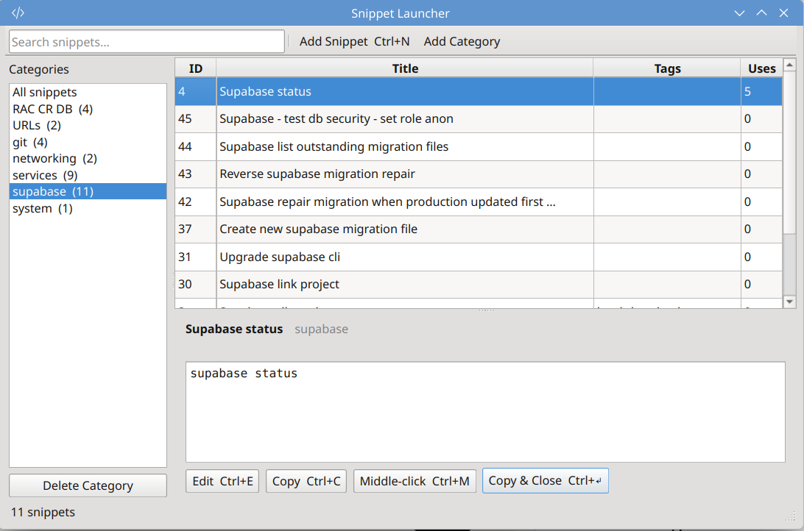

# SnippetLauncher

A keyboard-driven snippet manager for Linux desktops — works great on **KDE Plasma** and **GNOME**.

Store commands, code blocks, URLs and text fragments in categorised groups. Retrieve and paste them into any window via a clean Qt GUI or a Rofi quick-picker triggered by a global hotkey.



---

## Features

- 📁 User-defined categories (supabase, services, git, docker, etc.)
- 🔍 Live search across title, body and description
- 🖱️ Three paste modes: clipboard, middle-click, and copy-and-close
- 🔗 URLs in snippets are automatically detected and clickable
- ⌨️ Rofi quick-picker for hotkey-triggered access without opening the GUI
- 💾 Local SQLite database — your data stays on your machine
- 🎨 Inherits your desktop theme (KDE Plasma and GNOME)

---

## Requirements

- Python 3.11+
- `python3-venv`
- `wl-clipboard` (Wayland) or `xclip` (X11) for clipboard support
- `rofi` for the quick-picker hotkey launcher (optional)

Install system dependencies on Ubuntu/Debian/Pop!_OS:

```bash
# Required
sudo apt install python3-full python3-venv

# Clipboard (pick one based on your session)
sudo apt install wl-clipboard     # Wayland (KDE Plasma, GNOME on Wayland)
sudo apt install xclip            # X11

# Optional — for Rofi quick-picker
sudo apt install rofi
```

---

## Installation

```bash
git clone https://github.com/brianpundyke/snippetlauncher.git
cd snippetlauncher
chmod +x install.sh
./install.sh
```

The installer will:
- Check your Python version and dependencies
- Copy the app to `~/.local/share/snippetlauncher/`
- Create a virtual environment and install Python packages
- Seed example snippets to get you started
- Create a `snippetlauncher` command in `~/.local/bin/`
- Register the app in your desktop's application menu

No `sudo` required.

---

## Usage

### GUI

Launch from your app menu, or from the terminal:

```bash
snippetlauncher ui
```

### CLI

```bash
snippetlauncher list                          # list all snippets
snippetlauncher list --category git           # filter by category
snippetlauncher search "docker"               # search snippets
snippetlauncher add                           # add a snippet interactively
snippetlauncher show 5                        # print snippet body
snippetlauncher show 5 | bash                 # execute directly
snippetlauncher delete 5                      # delete a snippet
snippetlauncher category list                 # list categories
snippetlauncher category add "kubernetes"     # add a category
```

### Rofi quick-picker

```bash
snippetlauncher launch                        # all snippets
snippetlauncher launch --category supabase    # filtered
```

---

## Global Hotkey Setup

Register a hotkey in your desktop settings pointing to `snippetlauncher launch`:

**KDE Plasma:**
System Settings → Shortcuts → Custom Shortcuts → New → Command/URL
- Trigger: e.g. `Meta+S`
- Action: `snippetlauncher launch`

**GNOME:**
Settings → Keyboard → Custom Shortcuts → Add
- Command: `snippetlauncher launch`
- Shortcut: e.g. `Super+S`

---

## Uninstall

```bash
cd snippetlauncher
./uninstall.sh
```

Your snippet database is preserved by default. The uninstaller will ask before deleting it.

---

## Roadmap

- [ ] Custom app icon
- [ ] Import/export (JSON, CSV)
- [ ] Flatpak packaging for Flathub
- [ ] `anyrun` plugin as Rofi alternative
- [ ] Tag filtering in the GUI sidebar

---

## Contributing

Pull requests welcome. Please open an issue first to discuss significant changes.

## Licence

MIT
